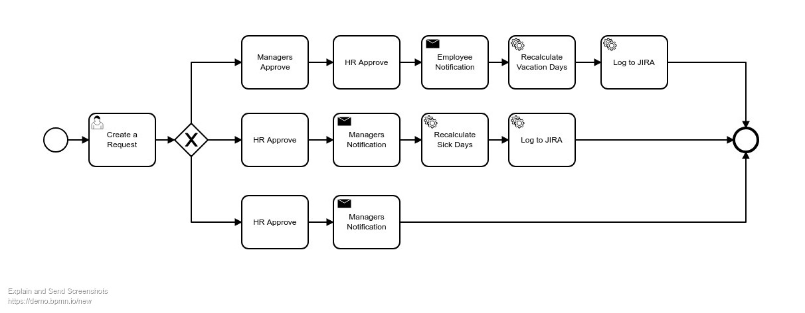

# Overview

For an example lets follow the whole process of implementing new buiseness process.

## Step #1. Describe the process

On this step a buisensess owner provides you requirements and (if you luck) a BPMN Diagram. 
For example, you get an requirement to implement a timeoff processes for some team. And here is the userstories.

* An employee can request a vacation:
  - Employee creates a request with type Vacation
  - All employee heads or managers will need approve the vacation
  - Then employee HR will approve the vacation
  - Then employee will reveive a email notification about approved vacation
  - Then need to recalculate the vacation days
  - Then need to log vacation to JIRA
* An employee can notify managers about his sick:
   - Employee creates a request with type SickDay
  - All employee heads or managers will be notified about employee sick
  - Then employee HR will approve the SickDay
  - Then need to recalculate the SickDay days
  - Then need to log sick day do JIRA
* An employee can notify managers about his sick leave (some kind of long sick):
  - Employee creates a request with type SickLeave
  - All employee heads or managers will be notified about employee sick
  - Then employee HR will approve the SickLeave



Looking at diagram above we can notice that there are only few types of blocks

1. User Task - A form where user should input some data. A Timeoff dates and type in our example.
2. Manual Task - Some task wich should be done munually by user. And after that confirm or reject executuin. An approves in our example
3. Service Task - Some logic needs to be performed by a system. An JIRA logging in our example
4. Email Notification. An managers or employee notifications in our example

Actually there is a specification [BPMN](http://www.bpmn.org/) which allows to describe any business process and a BPMN engines, like [Camunda](https://camunda.com/)

The point is that there are a lot of custom logic in many buiseness processes and using an universal engive will give you decent benefits only for a large projects. From pther side implementing this flow from scratch will require to write a flow implementation which can contain defects or something. 

The GraalBP - BPMN inspired framework for building buisness processes with Rails. It contains a bunch of tools for describing any buiseness process with GraalBP DSL. Or, wiwhout it, because you still have all power of the Rails framework. With GraalBP you not need to find compromice between configuring some BPMN processor (like Camunda) or writing implementation from scratch.  With the GraalBP everything is a code and developer just need to choose the best way to implement it.

The TF is an opensource ERP system based on GraalBP.

Lets implement our process.  

*Please note the the purpose of the example below is to show how GraalBp powerful are, but not to explain all its features*

## Flow

First of all need describe the flow

```ruby
module Employees::Timeoff
  class Process < GraalBP::Process
    unique_id :employees_timeoff
    title "TimeOff process"
    desc "Start an Employee Day Off request"

    action :perform do
      # empty initializer
    end
    .then(TimeoffRequest)
    .branch :vacation, when: -> (context) { context.starter_input.timeoff_type == 'vacation' } do
      action :perform do
      end
      .then(ManagersApprove)
      .then(HrApprove)
      .then(EmployeeVacationApproveNotification) 
      .then(RecalculateVacation)
      .then(LogTimeoffToJira)
    end
    .branch :sickday, when: -> (context) { context.starter_input.timeoff_type == 'sickday' } do
      action :perform do
      end
      .then(HrApprove)
      .then(ManagersNotification)
      .then(RecalculateSickDays)
      .then(LogTimeoffToJira)
    end
    .branch :sickleave, when: -> (context) { context.starter_input.timeoff_type == 'sickleave' } do
      action :perform do
      end
      .then(HrApprove)
      .then(ManagersNotification)
      .then(LogTimeoffToJira)
    end    
  end
end
```

As you can see the GraalBP provides a DSL for organizing a flow. With branches, conditions and so on. Next need to implement each step.

## Timeoff request

The `build` method allows to build a block with specific type. Each predefined block allows to implement it's kind of logic. E.g. user task will generate a Tasks and custom forms and will stop the process until all assigned user will complete the task. In the example below a user task for selecting start and end date and choosing a timeoff type. 

```ruby
module Employees::Timeoff
  class Process < GraalBP::Process
    unique_id :employees_timeoff
    title "TimeOff process"
    desc "Start an Employee Day Off request"

    class TimeOffTypes
      def self.collection
        ['vacation', 'sickday', 'sickleave']
      end
    end

    TimeoffRequest = build :user_task, :timeoff_employee_request do
      def assignee
        context.starter
      end

      def context_param
        :starter_input
      end

      def task_title
        "Fill your request for vacation: #{context.starter.email}"
      end  
  
      def self.form
        {
          template: 'form',
          fields: {
            start_date: {
              input: 'text_field'
            },
            end_date: {              
              input: 'text_field'
            },
            timeoff_type: {
              label: 'Type',
              input: 'select_field',
              collection_klass: 'Employees::Timeoff::Process::TimeOffTypes',
              collection_method: 'collection'
            },
            submit: {
              input: 'submit'
            }
          }
        }
      end
    end
end
```

## Managers Approve

The Manual Task the same as User task, but without any form fields by default. Just Approve and Reject buttons. The main point here is that this is a different launch of a process, but data from the previous step was restored and available in this step. We used the `starter_input` to build a form message

```ruby
module Employees::Timeoff
  class Process < GraalBP::Process
    unique_id :employees_timeoff
    title "TimeOff process"
    desc "Start an Employee Day Off request"

    ManagersApprove = build :manual_task, :timeoff_manager_approve do
      def assignee
        # put your real logic here
        User.where(email: ['pm1@test.com', 'pm2@test.com', 'tm@test.com'])
      end

      def context_param
        :managers_approve
      end

      def task_title
        "Approve vacation for: #{context.starter.email}"
      end   

      def form_message
        <<~MESSAGE
          <p>The #{context.starter_input.timeoff_type.humanize}" for #{context.starter.email}</p>
          <p>Start date: #{context.starter_input.start_date}</p>
          <p>End date: #{context.starter_input.end_date}</p>
        MESSAGE
      end
  
      def self.approve_button
        {input_html: {style: 'color:green'}}
      end

      def self.reject_button
        {input_html: {style: 'color:red'}}
      end
    end

    HrApprove = build :manual_task, :timeoff_hr_approve do
      def assignee
        # put your real logic here
        User.find_by!(email: 'hr@test.com')
      end

      def context_param
        :hr_manager_approve
      end

      def task_title
        "Approve vacation for: #{context.starter.email}"
      end   

      def form_message
        <<~MESSAGE
          <p>The #{context.starter_input.timeoff_type.humanize}" for #{context.starter.email}</p>
          <p>Start date: #{context.starter_input.start_date}</p>
          <p>End date: #{context.starter_input.end_date}</p>
        MESSAGE
      end

      def self.approve_button
        {input_html: {style: 'color:green'}}
      end

      def self.reject_button
        {input_html: {style: 'color:red'}}
      end
    end
end
```

## Email notifications

GraalBP has a DSL for describing email notifications. It has a pretty obvious interface.

```ruby
module Employees::Timeoff
  class Process < GraalBP::Process
    unique_id :employees_timeoff
    title "TimeOff process"
    desc "Start an Employee Day Off request"

    ManagersNotification = build :email, :some_email do
      def self.deliver
        {
          channel: :email,
          to: context.starter.project_managers + [context.starter.team_manager],
          from: 'hr@jetruby.com',
          subject: "{{context.starter.name}} takes a {{context.starter_input.timeoff_type.humanize}}",
          body: 'Hello, {{recipient.name}}. {{context.starter.name}} takes a {{context.starter_input.timeoff_type.humanize}}',
          async: true
        }
      end
    end

    EmployeeVacationApproveNotification = build :email, :some_email do
      def self.deliver
        {
          channel: :email,
          to: context.starter.project_managers + [context.starter.team_manager],
          from: 'hr@jetruby.com',
          subject: "Your vacation is approved",
          body: 'Hello, {{context.starter.name}}. Your vacation was approved',
          async: true
        }
      end
    end
end
```

## Service logic

The pure logic which makes the value. This is the main feature of GraalBP. It allows to write custom logic along with standard elements. In one place, which makes code clear and explicit.
Not need to do anything here in example, lets just output something

```ruby
module Employees::Timeoff
  class Process < GraalBP::Process
    unique_id :employees_timeoff
    title "TimeOff process"
    desc "Start an Employee Day Off request"

    RecalculateVacation = build :service_task, :recalculate_vacation do
      action :perform do
        puts '<' * 20
        puts "Recalculate vacation days"
        puts '=' * 20
      end
    end

    RecalculateSickDays = build :service_task, :recalculate_sick_days do
      action :perform do
        puts '<' * 20
        puts "Recalculate sick days"
        puts '=' * 20
      end
    end

    LogTimeoffToJira = build :service_task, :log_vacation_to_jira do
      action :perform do
        puts '<' * 20
        puts "Log days to JIRA"
        puts '=' * 20
      end
    end
end
```


## The result implementation

```ruby
module Employees::Timeoff
  class Process < GraalBP::Process
    unique_id :employees_timeoff
    title "TimeOff process"
    desc "Start an Employee Day Off request"

    class TimeOffTypes
      def self.collection
        ['vacation', 'sickday', 'sickleave']
      end
    end

    TimeoffRequest = build :user_task, :timeoff_employee_request do
      def assignee
        context.starter
      end

      def context_param
        :starter_input
      end

      def task_title
        "Fill your request for vacation: #{context.starter.email}"
      end  
  
      def self.form
        {
          template: 'form',
          fields: {
            start_date: {
              input: 'text_field'
            },
            end_date: {              
              input: 'text_field'
            },
            timeoff_type: {
              label: 'Type',
              input: 'select_field',
              collection_klass: 'Employees::Timeoff::Process::TimeOffTypes',
              collection_method: 'collection'
            },
            submit: {
              input: 'submit'
            }
          }
        }
      end
    end

    ManagersApprove = build :manual_task, :timeoff_manager_approve do
      def assignee
        # put your real logic here
        User.where(email: ['pm1@test.com', 'pm2@test.com', 'tm@test.com'])
      end

      def context_param
        :managers_approve
      end

      def task_title
        "Approve vacation for: #{context.starter.email}"
      end   

      def form_message
        <<~MESSAGE
          <p>The #{context.starter_input.timeoff_type.humanize}" for #{context.starter.email}</p>
          <p>Start date: #{context.starter_input.start_date}</p>
          <p>End date: #{context.starter_input.end_date}</p>
        MESSAGE
      end
  
      def self.approve_button
        {input_html: {style: 'color:green'}}
      end

      def self.reject_button
        {input_html: {style: 'color:red'}}
      end
    end

    HrApprove = build :manual_task, :timeoff_hr_approve do
      def assignee
        # put your real logic here
        User.find_by!(email: 'hr@test.com')
      end

      def context_param
        :hr_manager_approve
      end

      def task_title
        "Approve vacation for: #{context.starter.email}"
      end   

      def form_message
        <<~MESSAGE
          <p>The #{context.starter_input.timeoff_type.humanize}" for #{context.starter.email}</p>
          <p>Start date: #{context.starter_input.start_date}</p>
          <p>End date: #{context.starter_input.end_date}</p>
        MESSAGE
      end

      def self.approve_button
        {input_html: {style: 'color:green'}}
      end

      def self.reject_button
        {input_html: {style: 'color:red'}}
      end
    end

    ManagersNotification = build :email, :some_email do
      def self.deliver
        {
          channel: :email,
          to: context.starter.project_managers + [context.starter.team_manager],
          from: 'hr@jetruby.com',
          subject: "{{context.starter.name}} takes a {{context.starter_input.timeoff_type.humanize}}",
          body: 'Hello, {{recipient.name}}. {{context.starter.name}} takes a {{context.starter_input.timeoff_type.humanize}}',
          async: true
        }
      end
    end

    EmployeeVacationApproveNotification = build :email, :some_email do
      def self.deliver
        {
          channel: :email,
          to: context.starter.project_managers + [context.starter.team_manager],
          from: 'hr@jetruby.com',
          subject: "Your vacation is approved",
          body: 'Hello, {{context.starter.name}}. Your vacation was approved',
          async: true
        }
      end
    end

    RecalculateVacation = build :service_task, :recalculate_vacation do
      action :perform do
        puts '<' * 20
        puts "Recalculate vacation days"
        puts '=' * 20
      end
    end

    RecalculateSickDays = build :service_task, :recalculate_sick_days do
      action :perform do
        puts '<' * 20
        puts "Recalculate sick days"
        puts '=' * 20
      end
    end

    LogTimeoffToJira = build :service_task, :log_vacation_to_jira do
      action :perform do
        puts '<' * 20
        puts "Log days to JIRA"
        puts '=' * 20
      end
    end

    action :perform do
      # empty initializer
    end
    .then(TimeoffRequest)
    .branch :vacation, when: -> (context) { context.starter_input.timeoff_type == 'vacation' } do
      action :perform do
      end
      .then(ManagersApprove)
      .then(HrApprove)
      .then(EmployeeVacationApproveNotification) 
      .then(RecalculateVacation)
      .then(LogTimeoffToJira)
    end
    .branch :sickday, when: -> (context) { context.starter_input.timeoff_type == 'sickday' } do
      action :perform do
      end
      .then(HrApprove)
      .then(ManagersNotification)
      .then(RecalculateSickDays)
      .then(LogTimeoffToJira)
    end
    .branch :sickleave, when: -> (context) { context.starter_input.timeoff_type == 'sickleave' } do
      action :perform do
      end
      .then(HrApprove)
      .then(ManagersNotification)
      .then(LogTimeoffToJira)
    end    
  end
end
```

## Runing this example

If you have an installed instance of TF then you can run the example abow

1. Put the result process to `app/flows/timeoff/process.rb`
2. Create the new rake task and run it `rake graal:processes:import` (find it below)
3. Create some seeds (find it below)

**Import task**

```ruby
namespace :graal do
  namespace :processes do
    task import: :environment do
      # require all Processes

      Dir[Rails.root.join('app', 'flows', '**', '*.rb').to_s].each do |file|
        require file
      end

      # Now it can be looped through GraalBP::Process.descendants for registration 

      GraalBP::Process.descendants.each do |process_klass|
        process_record = GraalBP::Models::Process.where(unique_id: process_klass.interactor_id!).first_or_initialize
        process_record.update!(name: process_klass.title!, description: process_klass.description, process_klass: process_klass.name)
      end
    end
  end
end 
```

**Seeds**

```ruby
User.create!(email: 'employee@test.com', password: '11111111')
User.create!(email: 'pm1@test.com', password: '11111111')
User.create!(email: 'pm2@test.com', password: '11111111')
User.create!(email: 'tm@test.com', password: '11111111')
User.create!(email: 'hr@test.com', password: '11111111')
```

The login from each user and perform required actions